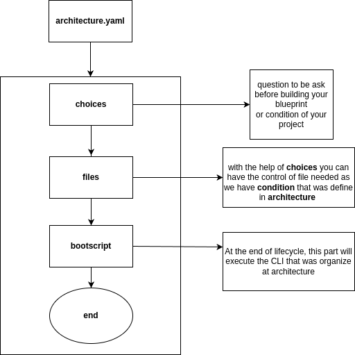

# Developer Guide
## Introduction
In this repository it details our available template framework or what we called `architecture` that consisted of different python framework
(but we will extend to support other language in next release this year).

As we are imagining on how to make our choices in flexibility, I decided to have and `architecture.yaml` that will handle your command control and preferred library in your template, in this way it will help you leverage the complexity of your application over passing  time.

Currently in this prototype stages, we are collecting ideas and opinion from other developer around the globe.

## Design concept
When you start in building your own project template, you must check our directory `blueprint` for the list of framework.

In image below, you will see the lifecycle in building your project template

As you noticed, we are supporting to have a cmd execution, just to give way in other framework like django that has its own project startup generator, therefore we are sure you are getting the fresh copy from the framework.

## Roadmap
In next release we will add support in other language like nodejs/javascript and golang
